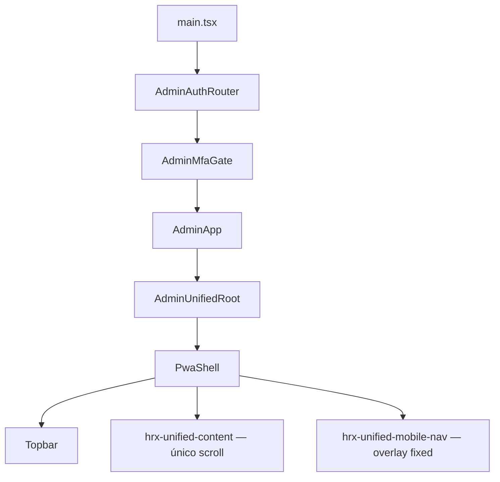

# Auditoria e correção do dock PWA iOS — HRX Admin

**Data:** 2026-08-25  
**Repositório:** `flanhenrique/HRX-SOLUCOES`  
**Branch:** `fix/pwa-mobile-dock-root-cause-20260825`

## Resultado executivo

O defeito não era um gap externo simples. A faixa era criada **dentro do próprio dock** pela última camada de CSS: o menu recebia `height: calc(64px + safe-area)` e `padding-bottom: calc(4px + safe-area)`. Com uma safe area de 34 px, o dock media 96 px e mantinha 38 px vazios abaixo de ícones e rótulos.

Ao mesmo tempo, Orçamentos carregava depois do shell um segundo layout fullscreen (`.admin-live-shell { position: fixed; inset: 0 }`) e Financeiro Pessoal adicionava um CTA fixo mais `188px + safe-area` de padding. Esses módulos podiam alterar novamente a geometria após a primeira navegação.

A correção consolidou viewport, scroll, safe area e dock em `admin-unified-shell.css`, transformou Orçamentos em view interna, removeu quatro folhas de remendo e eliminou reservas inferiores específicas das rotas.

## Sintoma

- dock visível, mas com faixa branca/azul/vazia abaixo dos controles;
- diferença mais evidente no PWA standalone do iPhone;
- reaparecimento após entrar em Orçamentos ou Financeiro;
- testes anteriores verdes apesar do defeito visual;
- risco de modal ficar na mesma camada ou abaixo do dock.

## Histórico resumido

O histórico contém mais de vinte alterações relacionadas a dock, safe area ou espaço inferior. Entre as tentativas recentes estão os commits `03b5ae9`, `ebd6a4d`, `af77962`, `591bcd2`, `f14b83f`, `9d04905`, `e0b0957`, `94dd550`, `529b31e` e `f3856df`.

Cada tentativa acrescentou uma nova camada de precedência sem retirar a anterior. No estado auditado, quatro arquivos de correção mobile mais o shell e o chrome somavam **538 declarações `!important`**. Depois da consolidação, os três arquivos ativos relevantes somam 307, redução aproximada de 43%, e somente um arquivo controla a geometria global.

## Cadeia real de layout

O elemento que recebe scroll é `.hrx-unified-content`. `html`, `body`, `#root` e `.hrx-unified-shell` permanecem travados na viewport. O dock é irmão do conteúdo e não participa do fluxo vertical.

## Ordem de CSS auditada

### CSS estático do AdminApp

1. `admin-page-system.css`
2. `admin-feedback.css`
3. `admin-interactions.css`
4. `admin-executive-intelligence.css`
5. `admin-liquid-glass.css`
6. `admin-responsive-hardening.css`
7. `admin-unified-shell.css`
8. `admin-unified-chrome.css`

### CSS lazy de Orçamentos

1. `quotes.css`
2. `quote-commercial.css`
3. `admin-quotes-mobile.css`

O CSS lazy agora contém apenas regras da rota. Ele não define `bottom`, `height` ou `padding-bottom` de `.hrx-unified-content` ou `.hrx-unified-mobile-nav`.

## Causa raiz comprovada

### Causa raiz

Uma cascata de shells e correções concorrentes fazia a safe area ser aplicada mais de uma vez. A regra vencedora de `admin-ios-viewport-dock-fix.css` incorporava toda a safe area à altura e ao padding interno do dock. A métrica antiga media somente `viewportBottom - dockRect.bottom`; como o dock terminava em `bottom: 0`, o teste retornava zero mesmo com 38 px vazios **dentro** dele.

Além disso:

- `quotes.css`, carregado depois, declarava `.admin-live-shell` como fullscreen fixo;
- `admin-mobile-usability-fixes.css`, `admin-mobile-floating-dock-fix.css` e `admin-unified-chrome.css` redefiniam o padding do conteúdo com valores diferentes;
- `public/hrx-brand-fix.css` ainda controlava `bottom` e `scroll-padding` do editor de Orçamentos;
- `admin-finance-scope.css` reservava `188px + safe-area` e criava um segundo CTA fixo acima do dock.

### Seletores responsáveis

- `.hrx-unified-shell.is-pwa`
- `.hrx-unified-shell.is-pwa > .hrx-unified-content`
- `.hrx-unified-shell.is-pwa > .hrx-unified-mobile-nav`
- `.admin-live-shell`
- `.quote-commercial-shell .admin-exec-main`
- `.quote-commercial-shell .admin-workspace.quote-workspace`
- `.personal-finance-page`
- `.personal-finance-page .finance-header-actions button.is-primary`
- `.quote-editor-scroll`
- `.quote-review-card > footer`

### Arquivos responsáveis

- `src/quotes/admin-ios-viewport-dock-fix.css`
- `src/quotes/admin-mobile-floating-dock-fix.css`
- `src/quotes/admin-mobile-safe-area-fixes.css`
- `src/quotes/admin-mobile-usability-fixes.css`
- `src/quotes/admin-unified-shell.css`
- `src/quotes/admin-unified-chrome.css`
- `src/quotes/quotes.css`
- `src/quotes/quote-commercial.css`
- `src/quotes/admin-finance-scope.css`
- `public/hrx-brand-fix.css`

### Por que as correções anteriores não resolveram

1. Mediam a borda externa do dock, não a área vazia interna.
2. As fixtures não carregavam `admin-ios-viewport-dock-fix.css`, que era justamente a última regra em produção.
3. Cada correção adicionava outro `!important`, mantendo regras antigas ativas.
4. Orçamentos e Financeiro carregavam CSS depois do shell e voltavam a reservar espaço.
5. A safe area era usada como altura, padding e offset em pontos diferentes.

## Arquitetura anterior

- shell PWA alternava entre grid e flex conforme o arquivo vencedor;
- conteúdo recebia 0, 78, 94 ou 104 px de padding inferior;
- dock alternava entre `absolute` e `fixed`, com diferentes `bottom`, alturas e raios;
- Orçamentos montava uma view fullscreen aninhada;
- Financeiro Pessoal mantinha CTA fixo e grande reserva inferior;
- modais usavam camadas entre 1000 e 3500, próximas ao dock 2400.

## Arquitetura corrigida

- `.hrx-unified-shell`: `position: fixed; inset: 0; height: auto`;
- topbar: filho flex com safe area superior;
- `.hrx-unified-content`: único scroll container, `overflow-y: auto`;
- dock: overlay `fixed`, altura constante de 62/64 px, a 6 px da borda;
- safe area inferior: eleva somente os controles dentro da cápsula, sem aumentar a superfície;
- proteção do último item: `scroll-padding-block-end` e clearance mínimo do container global;
- canvas do shell e do conteúdo usa a mesma cor até a borda física;
- pseudo-elementos do dock são desativados;
- modais relevantes usam `z-index: 5200`, acima do dock 2400;
- Financeiro Pessoal mantém o CTA no fluxo da rota;
- Orçamentos é uma view `position: relative` e recebe CSS mobile somente pelo módulo lazy.

## Arquivos removidos ou consolidados

Removidos:

- `admin-ios-viewport-dock-fix.css`
- `admin-mobile-floating-dock-fix.css`
- `admin-mobile-safe-area-fixes.css`
- `admin-mobile-usability-fixes.css`

Criado como CSS estritamente local da rota:

- `admin-quotes-mobile.css`

Consolidados:

- geometria global em `admin-unified-shell.css`;
- acabamento visual e tema em `admin-unified-chrome.css`;
- regras mobile de Orçamentos em `admin-quotes-mobile.css`;
- regras antigas de Orçamentos removidas de `public/hrx-brand-fix.css`.

## PWA auditado

- manifest: `display: standalone` e `display_override` com fallback;
- viewport: `viewport-fit=cover` no HTML e na política runtime;
- standalone iOS: `navigator.standalone` e `display-mode: standalone` reconhecidos;
- theme/background: definidos no manifest e atualizados pelo bridge do Admin;
- service worker: atualização atômica e política network-first para assets; não foi a causa geométrica.

No Safari comum, o browser mantém seus próprios chromes e a política de zoom acessível. No standalone, a viewport cobre a tela e os insets passam a ser relevantes. O teste automatizado simula `navigator.standalone`, safe area superior de 47 px e inferior de 34 px.

## Medições

### Antes — reprodução 390×844

| Métrica | Valor |
|---|---:|
| `window.innerHeight` | 844 px |
| `documentElement.clientHeight` | 844 px |
| `visualViewport.height` | 844 px |
| shell | 0–844 px |
| content | 64–844 px |
| dock | 748–844 px |
| altura do dock | 96 px |
| padding inferior interno do dock | 38 px |
| gap externo calculado | 0 px |

O gap externo zero mascarava a faixa interna de 38 px.

### Depois — safe area inferior simulada de 34 px

| Viewport | Dock | Gap externo intencional | Scroll | Último item |
|---|---:|---:|---|---|
| 390×844 | 62 px | 6 px | conteúdo apenas | acima do dock |
| 393×852 | 64 px | 6 px | conteúdo apenas | acima do dock |
| 402×874 | 64 px | 6 px | conteúdo apenas | acima do dock |
| 430×932 | 64 px | 6 px | conteúdo apenas | acima do dock |

Em todos os casos, shell e conteúdo terminam exatamente em `visualViewport.height`, o dock não muda de posição durante o scroll e não existe filho estrutural abaixo dele.

## Testes executados

- `npm run test:pwa`: **77/77 aprovados**;
- `npm run build`: **aprovado**;
- `npm run test:browser`: **35/35 aprovados**;
- viewports: 390×844, 393×852, 402×874 e 430×932;
- conteúdo curto e longo;
- topo, meio e fim do scroll;
- troca real de rota: Projetos → Orçamentos → Financeiro → Projetos → Documentos;
- carga lazy de Orçamentos e Financeiro;
- resize e landscape;
- standalone PWA simulado;
- bounding boxes e computed styles;
- modal 390×844 acima do dock;
- verificação visual manual das cinco capturas.

## Evidências

- [01 — Orçamentos no topo](EVIDENCIAS/2026-08-25_01_ORCAMENTOS-TOPO_402x874.png)
- [02 — Orçamentos no meio da lista](EVIDENCIAS/2026-08-25_02_ORCAMENTOS-MEIO_402x874.png)
- [03 — Orçamentos no final da lista](EVIDENCIAS/2026-08-25_03_ORCAMENTOS-FINAL_402x874.png)
- [04 — dock e home indicator simulado](EVIDENCIAS/2026-08-25_04_DOCK-SAFE-AREA_402x874.png)
- [05 — modal Financeiro acima da interface](EVIDENCIAS/2026-08-25_05_MODAL-FINANCEIRO_390x844.png)

## Riscos residuais

- Playwright/Chromium não reproduz bugs exclusivos do compositor WebKit. A geometria do iPhone foi simulada com os insets reais típicos e validada por bounding boxes; recomenda-se smoke test final em aparelho físico antes do merge.
- O projeto ainda possui `!important` em estilos visuais legados de rotas. Eles não controlam mais a geometria global, mas podem ser reduzidos em uma limpeza visual separada.
- O service worker pode manter uma versão antiga até a atualização atômica concluir; isso afeta rollout, não a correção estrutural.

## Resultado final

Os gates automatizados e visuais confirmam uma única fonte de verdade para viewport, scroll e dock. O menu permanece fixo, a safe area não amplia sua altura, não há faixa estrutural abaixo dele, o último item permanece acessível, CSS lazy não altera a geometria e os modais cobrem a interface inteira.
